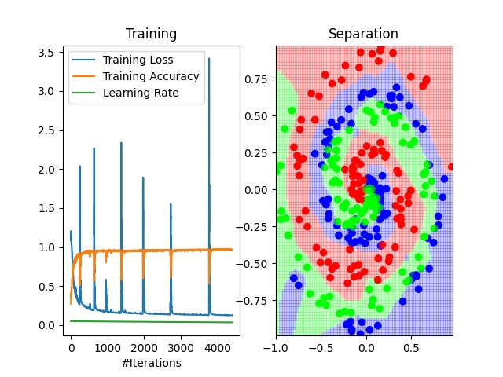

## Work in progress!

Implementation of a Neural Network from scratch with `python`, including forward and backward propagation, following the book "Neural Networks from Scratch in Python, Harrison Kinsley & Daniel Kukieła".

The motivation behind this project is perfectly expressed by R. Feynman's famous quote: 
>"What I cannot create, I do not understand"

#### What it does up until now
Example of multiclass classification with Momentum GD and decaying learning rate. A bit of overtraining (scattered points are training points).

Example of multiclass classification with Adam optimizer and 0.1 Dropout. Less overtraining thanks to the regularization action of dropout and early stopping.

#### Project Checklist
- [x] Dense Layer (Forward and Backward pass);
- [x] Activation Functions (Forward and Backward pass):
    - [x] ReLU;
    - [x] Softmax;
    - [x] Sigmoid;
    - [x] Linear;
- [x] Loss Functions (Forward and Backward pass):
    - [x] Categorical Cross-Entropy;
    - [x] Binary Cross-Entropy;
    - [x] Accuracy for classification;
    - [x] Mean Squared Error (MSE);
    - [x] Mean Absolute Error (MAE);
- [x] Optimizers:
    - [x] Vanilla GD;
    - [x] Decay GD;
    - [x] Momentum GD;
    - [x] AdaGrad;
    - [x] RMSProp;
    - [x] Adam;
- [x] $L_1$ and $L_2$ regularization (Forward and Backward pass);
- [x] DropoutLayer (Forward and Backward pass);
- [ ] `Model` class;