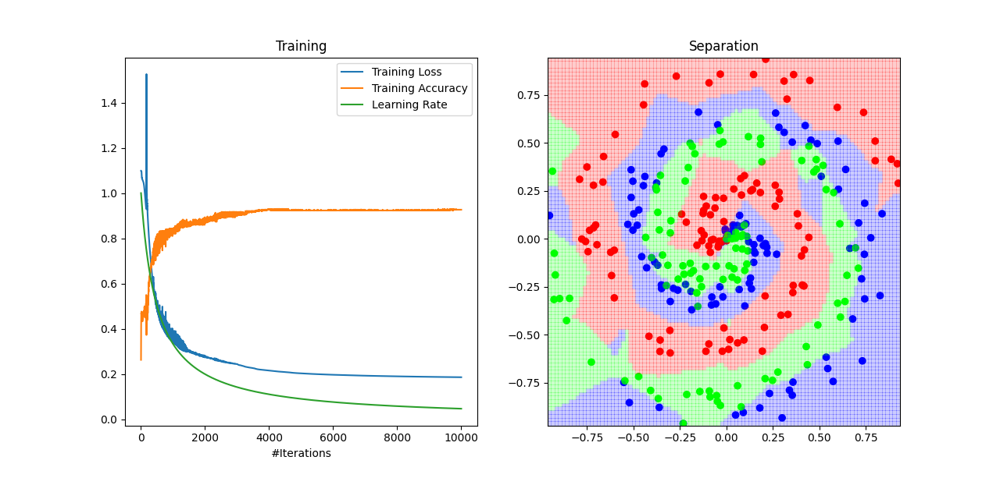

## Work in progress!

Implementation of a Neural Network from scratch with `python`, including forward and backward propagation, following the book "Neural Networks from Scratch in Python, Harrison Kinsley & Daniel Kukieła".

The motivation behind this project is perfectly expressed by R. Feynman's famous quote: 
>"What I cannot create, I do not understand"

#### What it does up until now
Example of multiclass classification with Nesterov GD and decaying learning rate. A bit of overtraining (scattered points are training points).

