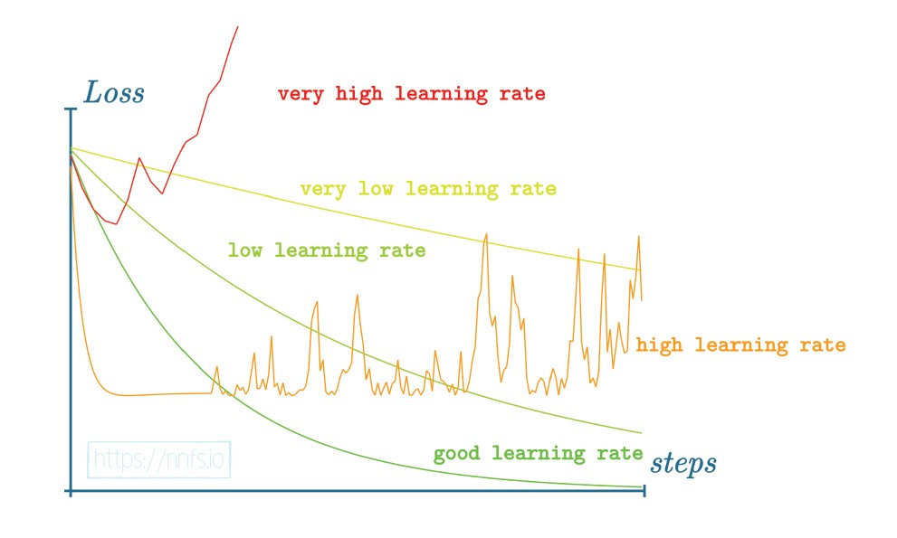

# Notes

### Notation, conventions, and other stuff
- NN = Neural Networks, ML = Machine Learning, SV = Supervised Learning;
- I adopt a notation (taught to me by my uni professor) that I find very useful in ML, which is to denote with a hat all of the quantities that depend on the dataset (empirical quantities), e.g. $\hat{X}$;
- I name every variable or function with lower camel case, every class with upper camel case; file names are in lower camel case except if they contain a class;

### Files description
- `toyCode/singleLayerForwardPass.py`: forward pass of a single input vector;
- `toyCode/singleLayerForwardPassBatchOfInputs.py`: forward pass of a batch of input data points;
- `toyCode/twoLayersForwardPassBatchOfInputs.py`: forward pass of a batch of data through two layers;
- `DiyKeras/DenseLayer.py`: contains the class `DenseLayer`;
- `DiyKeras/ActivationFunctions.py`: contains the activation functions' classes;
- `DiyKeras/LossFunctions.py`: contains the loss functions' classes;
- `test.py`: a small test of the forward pass of the implemented classes;
- `testBackprop.py`: a small test of the backward pass of the implemented classes;
- `GDtest.py`: a small test of the minimization process;

## General Notes

### Batch of data
A batch of data from the feature space is contained in the matrix $\hat{X}$. Even though each sample in the batch is a vector in the feature space, it is common practice to treat them as row vectors inside the matrix, so that $\hat{X}$ will be an $n\times d$ matrix (with $n$ number of samples and $d$ dimensionality of the feature space). Along with this choice, for any given matrix, it is common practice to let the first index run through the cardinality of the sample, and treat vectors as row vectors. For instance, the matrix of neuron's weights will have the first index selecting the i-th neuron and the second index selecting the j-th weight of the i-th neuron. The matrix $W$ will be $w \times d$ with $w$ width of the layer (number of neurons) and $d$ dimensionality of the input.

With this choices, the action of a layer on the input batch (neglecting activation functions) is:
$$\bm{\hat{Y}} = \hat{X}W^\top + \bm{b}$$

$\hat{X}W^\top$ is a matrix product between matrix of shapes $n\times d$ and $d \times w$ resulting in a matrix $n \times w$; the first index of the output matrix points to the output of the i-th data point, and the second index runs through the dimensionality of the output space.
**Note 1:** Later in the book, the authors define the weights' matrix to be of shape $d \times w$ in order to get rid of the transpose operation. This has obvious computational advantages, so I will adopt their choice, making the first index of $W$ run trough the dimensionality of the input space and the second one run through the neurons in the layer. With this choice the forward pass is simply:
$$\bm{\hat{Y}} = \hat{X}W + \bm{b}$$
and we avoid a transposition each time.
**Note 2:** the direct sum of $\hat{X}$ and $b$ is not mathematically well defined, since b is a row vector of dimension $w$ and $\hat{X}W$ is a matrix of dimension $n \times w$. Nevertheless, in this case, `numpy` sums b to each row of $\hat{X}W$ which is exactly how a bias behaves.

### Multiple Layers
The dimensionality of the weights of the next layer is determined by the previous one, while the number of neurons is arbitrary.
So, let $W_i$ be the weights' matrix of the i-th layer and $w_i$ the width of the i-th layer (e.g. the number of neurons in the i-th layer): then $W$ will have dimension $w_{i-1} \times w_i$.

### Weights initialization
Usually this process is randomized and weights are initialized with small absolute values, typically sampling a gaussian pdf. Biases are typically initialized to zero. These are not the only or best choices in every scenario, and some considerations can increase the performances of an algorithm:
- Typically optimized weights end up being between $\pm1$; the common choice is to initialize them 
a couple of magnitude order below, because otherwise the training will require a lot of time because the correction at each epoch is small (and the majority of weights will not be near $\pm1$).
- Biases guarantees that a neuron fires even if it's not been activated by the input;
- In cases where a neuron does not fire for any sample in the batch (common case with sparse signals), a non zero bias guarantees that we do not end up in what's called a "dead net", characterized by:
    - One or more neurons in the first layer that are silent for every input;
    - These zero outputs are fed to the next layer, killing other neurons throughout the network;
    - The network becomes untrainable: this is a clear indication that we need to think about different initializations;

### Activation functions
Activation function are deployed on each layer to estimate non linear relations between the input and the output spaces. The forward pass defined as $\hat{X}W$ is linear, so it will only estimate linear target functions. If you add a bias it is non linear, but it's still a very simple model.
The way in which NNs add the non-linearity (as opposed to kernel methods) is by wrapping all the linear model in a non-linearity (the so called activation function):
$$\bm{\hat{Y}} = \sigma(\hat{X}W + \bm{b})$$
This mimics the behavior of a biological neuron.

Typically all hidden layers will have the same activation function (but it's not a must), while the output layer's activation function varies based on the application (regression, binary/multiclass classification).

#### Types of activation functions considered

##### Mostly for hidden layers
- **Heaviside**: easiest activation, the neuron only fires if a certain threshold is reached. It's been deployed historically but nowadays it's dismissed;
- **Linear**: should be called identity since it leaves the forward pass unaltered; it is commonly deployed in the output layer for regression models where one has to estimate a real number potentially unbounded. Nevertheless, if every layer uses the linear activation function, the model will only estimate linear target functions;
- **Sigmoid**: it's meant to be a little more informative than the Heaviside one, by carrying also the information of "how close we were to the activation threshold" (mathematically, it should be invertible). Mathematically, it is the logistic curve defined by:
$$y = \frac{1}{1+e^{-x}}$$
Nowadays it's been replaced by the ReLU (mainly for speed and efficiency), although it's worth to notice that the sigmoid is the natural activation function inside animal's neurons.
- **ReLU**: rectified linear units, it's the most common activation function for hidden layers. Can be defined as:
$$y = \max\{0,x\}$$
By linear combination of ReLUs we are estimating a function with linear interpolation, with a granularity that is proportional to the number of neurons.

##### Mostly for output layer
- **Softmax**: deployed in classification models to get an output which is interpretable as a probability (i.e. normalized) from non normalized inputs. The output of softmax will be a vector of $m$ dimension, with m number of classes in the classification setup. The entries of the vector sum up to one and are the probabilities of the input to belong to the respective class (confidence scores). The analytical formulation is:
$$Y_i = \frac{e^{x_i}}{\sum\limits_{j=1}^{d}e^{x_j}}$$
where $d$ is the dimensionality of the output of the previous layer.
In the implementation, to avoid exploding exponentials, the $x_i$ are firstly shifted back by the largest $x_i$ so that the exponential will have at most 0 as an argument. The normalization guarantees that the final confidence scores are unaltered by this shift.

### Loss Functions

#### Mean Squared Error
Loss function typically deployed in regression (but also suitable for classification).

#### Categorical (Binary) Cross Entropy
Loss function deployed in classification problems, perfect if coupled with softmax in the last layer. It compares the confidence scores predicted by softmax $\hat{y}_i$ with the true labels $y_i$ in the following manner (note: this only refers to one point and the true labels are not $\pm1$ but are converted to vectors with a one in the class in which the point belongs, e.g. with to_categorical):
$$\hat{l}_{CE} = -\sum\limits_{j=1}^{m} y_j\ln(\hat{y}_j) = -\sum\limits_{j|y_j=1}\ln(\hat{y}_j)$$
More precisely, the first sum is called cross-entropy and is a more general functional that compares two vectors containing samples of a distribution. When applied to a vector that indicates in which class the points belong (e.g. $y_i = (1,0,0,0)$), cross-entropy takes the form of the second sum and it's called categorical cross-entropy. If $m=2$ the classes are mutually exclusive and the confidence scores must sum up to one, so categorical cross entropy takes the form:
$$\hat{l}_{CE} = -(y\ln(\hat{y}) + (1-y) \ln(1-\hat{y}))$$
and it is called binary cross entropy.

Categorical (binary) cross-entropy works by pushing the network to maximize the confidence on the true class (it's the only class that enters the sum in the loss, and $\min\{\ln(x)\}|_{x<1}$ is 1). It does not explicitly force the other scores to be zero, but this is achieved tanks to normalization.

**Note:** when using categorical cross-entropy the belonging class of the point must be labelled with 1 and the others to zero, not $\pm1$. This is called **one-hot** encoding.

### Backpropagation

Backpropagation is an automatic differentiation algorithm. It calculates the gradient of the loss function with respect to the weights of the neurons: the gradient is then deployed to minimize the loss with iterative optimizers. The key tool of backpropagation is the chain rule: $\frac{\partial}{\partial x} f(g(x)) = \frac{\partial f}{\partial g}\frac{\partial g}{\partial x}$. 

Chain rule can be iteratively applied to the function that maps the input of the network to its outputs, since this function is the composition of each forward pass.

The name backpropagation is due to the fact that the gradient of the loss function is evaluated by multiplying the gradient of each layer, starting from the last one and going backward: this is because, when applying chain rule, one starts by differentiating the "outer" function, which in our case is the last forward pass.

To calculate the gradient with backpropagation we need to do four steps:
1. Calculate the gradient of the loss function (the first differentiation in backpropagation order);
2. "Climb up" to the layer that contains the weight/bias with respect to which we are differentiating, and we need to link layers together while we go up;
3. Differentiate the activation function with respect to the linear combination $\hat{X}W+b$ calculated by the neurons;
4. Calculate gradient of the linear combination itself;

We go through each step.

#### Step 1: Loss function derivative

##### Categorical Cross-Entropy
We recall the functional form of the categorical cross-entropy loss:
$$\hat{L}_{CE} = -\sum\limits_{i} y_i \ln(\hat{y}_i)$$
We take the derivative with respect to the part that contains an implicit dependance on the model parameters, i.e. $\hat{y_i}$:
$$\frac{\partial \hat{L}_{CE}}{\partial \hat{y}_j} = -\sum\limits_{i}y_i \frac{\partial}{\partial \hat{y}_j} \ln(\hat{y}_i) = - \sum\limits_i \frac{y_i}{\hat{y}_j}\delta_{ij} = -\frac{y_i}{\hat{y}_i}$$

#### Step 2: Chaining Layers in Backpropagation
For the sake of simplicity let's consider two layers composed by one neuron each, and taking in input just one connection each.

Let's call the first neuron (first in the architecture) "neuron 1", and the second "neuron 2". Their quantities will be denoted with their respective subscript. Let $x_i$ be the input of the neuron $i$, and $y_i$ its output. The output $y_2$ of the network is:

$$y_2 = \sigma_2 (w_2\cdot x_2 + b_2) = \sigma_2 (w_2\cdot y_1 + b_2)$$
where $y_1$ is the output of the first neuron. Let's explicit that:

$$y_2 = \sigma_2 (w_2 \cdot (w_1\cdot x_1 + b_1) + b_2)$$

Let's evaluate the derivative of $y_2$ with respect to the bias and weight of the first layer:

$$\frac{\partial y_2}{\partial w_1} = \frac{\partial \sigma_2(w_2 \cdot y_1(w_1) + b_2)}{\partial (w_2 \cdot y_1(w_1) + b_2)} \frac{\partial (w_2 \cdot y_1(w_1) + b_2)}{\partial y_1(w_1)} \frac{\partial y_1(w_1)}{\partial w_1} = \frac{\partial y_2}{\partial x_2} \frac{\partial y_1}{\partial w_1}$$

Where I've defined: 
$$\frac{\partial y_2}{\partial x_2} \coloneqq \frac{\partial \sigma_2(w_2 \cdot y_1(w_1) + b_2)}{\partial (w_2 \cdot y_1(w_1) + b_2)} \frac{\partial (w_2 \cdot y_1(w_1) + b_2)}{\partial y_1(w_1)}$$

which is the derivative of the output of the second layer with respect to its inputs, with the chain rule made explicit.

From this example we can generalize one important result: when differentiating the output of a network with respect to a weight of the neuron $j$ of the layer $i$ we need to differentiate the output of the layer $j$ with respect to the weight $i$, but firstly we need to "go backward to the layer $j$ starting from the last one". This "going backward" is made by iteratively differentiate the outer functions with respect to their portion which depends on $w_{i,j}$: i.e. their inputs! This is because the output of the layer $j$ is the input of the layer $j+1$ and so on, so the dependance of the weight $w_{i,j}$ is implicitly contained in the inputs of the consecutive layers. **When backpropagating, the quantity that chains a layer with the previous (pervious in a backpropagation sense) is the derivative of the previous layers with respect to its inputs!**

#### Step 3: Derivative of the activation function
##### ReLU
The derivative of the ReLU function is straightforward: 
$$\frac{d ReLU(x)}{dx} = \begin{cases}  
    1 & \text{if } x>0 \\
    0 & \text{if } x<0
\end{cases}$$
Techincally, in zero the ReLU is not differentiable. By exploiting the so called subgradient one might take the smallest value of the derivatives in zero and define:
$$\frac{d_{sub} ReLU(x)}{dx} = \begin{cases}  
    1 & \text{if } x>0 \\
    0 & \text{if } x\leq0
\end{cases}$$

##### Softmax
We recall the functional form of the softmax activation:
$$S_i = \frac{e^{x_i}}{\sum\limits_{j=1}^{d}e^{x_j}}$$
We need to differentiate it wrt $x_k$ since it is the quantity that implicitly depends on the parameters of the model.

$$\frac{\partial S_i}{\partial x_k} = \frac{\partial}{\partial x_k} (e^{x_i}) \cdot \frac{1}{\sum\limits_{j=1}^{d}e^{x_j}} + e^{x_i} \cdot \frac{\partial}{\partial x_k} \frac{1}{\sum\limits_{j=1}^{d}e^{x_j}} = \frac{e^{x_i}\delta_{ik}}{\sum\limits_{j=1}^{d}e^{x_j}} - e^{x_i} \frac{1}{(\sum\limits_{j=1}^{d}e^{x_j})^2}e^{x_k} = $$

$$= \frac{e^{x_i}\delta_{ik}}{\sum\limits_{j=1}^{d}e^{x_j}} - \frac{e^{x_i}}{\sum\limits_{j=1}^{d}e^{x_j}}\frac{e^{x_k}}{\sum\limits_{j=1}^{d}e^{x_j}} = S_i \delta_{ik} - S_i S_k$$

When we let i and k run we get a matrix equation:
$$\mathbb{I} \bm{S} - (\overleftrightarrow{S})$$
where $\bm{S}$ is the vector of confidence scores and $\overleftrightarrow{S}$ is the matrix with entries: $\overleftrightarrow{S}_{ij} = S_iS_j$. The resulting matrix is the Jacobian matrix.

Note that this time the result of the differentiation is a matrix (the Jacobian), while for the previous derivatives the results were vectors or scalars. This is because this time we are differentiating a vector (the output of the softmax): the result of the differentiation of a vectorial field is a Jacobian, not a gradient.

Finally, we generalize to a batch of data: in this case we'll get a Jacobian for each point in the batch, so the equation will be a "tensor" equation.
The last question to answer is this: to chain the softmax with the next (in backpropagation sense) layers we use a vector, not a matrix (the variable `dvalues` which is the parameter in every backwardPass method is indeed a vector). How do we convert the Jacobian into a vector? And how do we chain it with the previous layer (which is the loss function, since the softmax is the last layer)?

The $j$-th row of the Jacobian is the gradient of the $j$-th output of the softmax wrt the inputs of the softmax. We chain the gradient of the loss function with the Jacobian of the softmax to obtain the result vector we need:
$$\bm{v} = \bm{J_S}\nabla \hat{L}$$
We are projecting the gradient of the loss function on each gradient of the softmax wrt each of its inputs. The entries of the resulting vector are these scalar products:
$$(\bm{v})_i = \nabla_{x}S_i \cdot \nabla_y \hat{L}$$
where $x$ are the softmax's inputs and $y$ are the softmax's outputs (i.e. loss function's inputs). The vector $\bm{v}$ is the final result of the backpropagation of one point, as we wanted. Again consistently with our sizes requests, when operating with a batch of data the result of backpropagation is of shape `(nBatch,nCategories)`. 

**Computational note:** when building the matrix $\mathbb{I}\bm{S}$ one could use `np.eye(nCategories)@S`, but this implies the instantiation of an identity matrix and then a `matmul`.
It's more convenient to use the function `np.diagflat(S)` which directly creates a diagonal matrix with the entries of the vector `S` on the diagonal.

##### Softmax & Categorical Cross-Entropy
If we are using softmax and categorical cross-entropy together, the analytical solution of these two backpropagation steps takes a simple form that is computationally faster than chaining the layer together by calculating the gradients separately and then projecting them on each others as we did before. Let's calculate the analytical solution of the gradient. We start from the following results:
- Jacobian of the softmax wrt its inputs: $\bm{J_S} = \mathbb{I}\bm{S} - \overleftrightarrow{S} \implies (\bm{J_S})_{ij} = S_i\delta_{ij} - S_i S_j$
- Gradient of the cross-entropy wrt softmax's outputs: $(\nabla_{\bm{S}}\hat{L}_{CE})_i = -\frac{y_i}{S_i}$

Now we explicitly calculate the entries of $\bm{v}$:

$$(\bm{v})_k = (\bm{J_S} \nabla_{\bm{S}}\hat{L}_{CE})_k = \sum\limits_{j} (\bm{J_S})_{kj} (\nabla_{\bm{S}}\hat{L}_{CE})_j = \sum\limits_j (S_k\delta_{kj}-S_kS_j)(-\frac{y_j}{S_j}) =$$

$$= -\sum\limits_j \frac{y_jS_k}{S_j} \delta_{kj} + S_k \sum\limits_j y_j  = -y_j + S_k = \hat{y}_k - y_k$$
where, to evaluate the sum in the second term, I exploited the fact that $y$ are one-hot vectors so the sum of their components is 1.

We've come to a simpler form for the gradient of the categorical cross-entropy combined with the softmax activation:

$$(\bm{v})_k = \hat{y}_k - y_k$$

#### Step (3),4: Derivative of the output of a layer
Now that we know how to chain layers to "climb back" to the one we need to differentiate and how to differentiate losses and activation functions, we must differentiate the layer itself with respect to its weights and biases. We end up with two terms, again thank to chain rule. The output of a layer is given by:
$$y = \sigma(f(\hat{X};W;b)) = \sigma (\hat{X}W + b)$$
Chain rule gives:
$$\nabla_w y = \frac{\partial \sigma}{\partial f} \nabla_w \hat{X}W$$

$$\nabla_b y = \frac{\partial \sigma}{\partial f} \nabla_b b$$
The two arising terms are:
- The derivative of the activation function with respect to its input, which we discussed in step 3;
- The gradient of the linear combination with respect to the weights or the biases;

The gradients of the linear combination are:
- $\nabla_w \hat{X}W = X^\top$
- $\nabla_b b = 1$

Now we have everything we need to apply backpropagation.

### Optimizers
Differently from the book, I utilize the following naming convention for optimizers:
- Gradient Descend: calculates the gradient on all of the data in the training set;
- Stochastic Gradient Descend: calculates the gradient on one random point of the training set;
- Minibatch Gradient Descend: calculates the gradient on a sub-sample of the training set;

#### Gradient Descend
The update of the weights of a layer is given by:
$$\bm{w}_{t+1} = \bm{w}_{t} - \gamma \nabla_{\bm{W}} \hat{L}$$
In the implementation of the backward pass of the book, the gradient is already evaluated as the mean of the gradients on all of the points in the batch (`self.inputs.T@dvalues` is the mean of all of the gradients, because the row $j$ contains th sum of all of the $j$-th components of the data multiplied by the $j$-th component of their respective gradients; the factor $\frac{1}{N}$ is there because we've normalized the gradient of the loss function). So the implementation of the book is a full-batch gradient descend. To implement SGD or mini-batch GD I will need to modify all of the backward passes, for them to consider just one data point or a bunch of them.

**Note:** the decision between GD/SGD/mini-batch GD is not in the optimizer class but in how layers/activation functions/loss calculate their gradients.
**Note:** the normalization of the gradient is inserted to avoid exploding gradients: if the sum of all of the gradients is too big the value overflows and the model becomes untrainable.

#### Learning Rate
Learning rate is the fraction of the gradient that we use to update the parameters. It is a crucial hyperparameter of the model and its value can make the difference between the model converging to the global minimum of the loss function or for it to get stuck in a local sub-optimal minimum.

Since the loss function of a NN is characterized by a lot of local minima the problem of not getting stuck in them is of primary importance. An high learning rate guarantees a good exploration of the loss domain, eventually finding the global minimum. On the other hand, an high learning rate makes the model unstable, because a stabilization of the parameters won't happen unless the gradient is very close to zero (which is unlikely). This means that we need to find a trade-off between exploration and stability (similar to importance sampling). This is why other algorithms aside GD/SGD are deployed, mainly adding learning rate decay and inertia to the minimizer.

##### Learning Rate Decay
The first idea is to modify the learning rate during training. One can do it dynamically based on how the loss is evolving (e.g. speeding up the learning rate when the loss is stabilizing and vice versa, kind of like importance sampling), or by letting the learning rate decay with iterations:

$$LR(i) = LR(0) \cdot \frac{1}{1+\varepsilon i}$$
where $i$ is the iterations' index.

#### GD with momentum
Another solution to avoid getting stuck in a local minimum is adding an inertia term to the GD recursive equation, making it actually solve a similar differential equation to the one of a ball rolling downhill.
The inertia term can make the ball overcome a local minimum if it's not too deep. Indeed, the inertia term might make the direction of the next step pointing away from the local minimum even if the gradient would of course point towards it. The update step is done by evaluating the velocity (or momentum) for the update by linearly combining the current momentum and the current gradient:
$$\bm{v}_{t+1} = \beta \bm{v}_{t} - \gamma_t \nabla_{\bm{W}} \hat{L}$$
This corresponds to the evaluation of the moving average of the gradient (which smoothens the gradient's oscillations). Then the update is given by the sum of the current weights and the updated momentum:
$$\bm{w}_{t+1} = \bm{w}_{t} + \bm{v}_{t+1}$$

**Note**: This is different to Nesterov's accelerated gradient. In NAG the gradient is evaluated wrt an intermediate step for the weight ($w_{intermediate} = w_{t} + v_{t}$), while in this algorithm it is evaluated wrt the current weights.
**Note**: if using a decaying learning rate, for $t\rightarrow +\infty$ the weights' update won't stop.

#### AdaGrad
This algorithm introduces the idea of adapting the learning rate for each individual weight, based on the previous gradient of the weight. If the previous update on a given weight were big, then the learning rate slows down to allow other weights to catch up. The idea is that it's better to keep the weights' update as homogeneous as possible.

To do so a cache of the previous updates is stored (calculates as the squared sum of the previous updates), and the next weights' update is evaluated as:
$$\bm{w}_{t+1} = \bm{w}_{t} - \gamma_t \frac{\nabla_{\bm{W}} \hat{L}_t}{\sqrt{\sum\limits_{t=0}^{t}(\nabla_{\bm{W}} \hat{L}_{t})^2}+\epsilon}$$
where the vector division is meant to be a component-wise division.
**Note:** the denominator is a monotonic rising function wrt to $t$, so the weights' update will reach a stall after a certain $t$. The parameter $\epsilon$, instead, is added to avoid zero divisions.

#### RMSProp
The algorithm is identical to AdaGrad, it only changes the way the cache of changes is evaluated. Instead of:
$$\bm{c}_{t+1} = \sum\limits_{t=0}^{t}(\nabla_{\bm{W}} \hat{L}_{t})^2$$
that can be rewritten in the recursive form:
$$\bm{c}_{t+1} = \bm{c}_{t} + (\nabla_{\bm{W}} \hat{L}_{t})^2$$
RMSProp calculates the cache as:
$$\bm{c}_{t+1} = \rho \bm{c}_{t} + (1-\rho)(\nabla_{\bm{W}} \hat{L}_{t})^2$$

The purpose of this modification is to damp oscillations in the gradients' cache by introducing a moving average, similarly to momentum GD. This also enables the algorithm to keep updating the parameters regardless of the number of iterations.
**Note:** the learning rate needs to be significantly lower than 1, because with $\rho=0.9$ the model carries a lot of momentum and a small gradient is enough to keep it going.

#### Adam

This algorithm is the union of momentum GD and RMSProp: it has a moving average in the gradient descent update and a per-weight adaptive learning rate with moving average in the cache. In addition it has a term that amplifies the updates at the beginning of the training, so that in the first iterations the learning process is speeded up.

The algorithm is composed of the following steps (momentum evaluation changes a bit):
- Calculate the current momentum and cache based on the current gradient:
$$\bm{v}_{t+1} = \beta_1 \bm{v}_t + (1-\beta_1)\nabla_{\bm{W}} \hat{L}_{t}$$

$$\bm{c}_{t+1} = \beta_2 \bm{c}_t + (1-\beta_2)(\nabla_{\bm{W}} \hat{L}_{t})^2$$

- Divide the momentum and the cache by the amplification factor:
$$\bm{v}_{t+1}' = \frac{\bm{v}_t}{1-\beta_1^{t+1}}$$

$$\bm{c}_{t+1}' = \frac{\bm{c}_t}{1-\beta_2^{t+1}}$$

- Update the parameters:
$$\bm{w}_{t+1} = \bm{w}_{t} - \gamma_t \frac{\bm{v}'_{t+1}}{\sqrt{\bm{c}_{t+1}'}+\epsilon}$$

The division by $1-\beta_i^{t+1}$ amplifies the gradient and the cache for $t \ll 10$ then it stops (the +1 is to avoid zero division in the first iteration).

### Regularization in a NN

#### Norm regularization

As in classical Machine Learning, regularization helps to control overfitting by encouraging the smoothness of the estimated function.

One way to regularize a NN is to penalize the loss with the $L_1$ or $L_2$ norm, again as in classical ML.

The $L_1$ penalization is defined as:
$$L_{1,reg} = \lambda_1 \sum\limits_i ||\bm{w}_i||_L$$
where $||\cdot||_L$ is the norm.

The $L_2$ penalization is defined as:
$$L_{2,reg} = \lambda_2 \sum\limits_i ||\bm{w}_i||^2_L$$
where $||\cdot||_L$ is the norm.
The regularization parameters $\lambda_i$ control the strength of the regularization. These contributions add up to the data loss to form the total loss function in the forward pass.

Since we also want to encourage changes mostly in smaller weights (that's the whole point of AdaGrad and its successors), the $L_2$ norm is preferable since it penalizes more the higher weights.

##### Backward pass with regularization

For the backward pass we also need to differentiate the penalization terms in order to account for their gradients. The results are different for $L_1$ and $L_2$ norm.
###### $L_1$ norm

The $L_1$ norm is not differentiable in zero so we use the sub-gradient defined as:

$$\frac{d_{sub}}{d\bm{w}_j} L_{1,reg} = \lambda_1 \sum\limits_j \frac{d_{sub}}{d\bm{w}_j} ||\bm{w}_i||_L  = \lambda_1 \sum\limits_i \begin{cases}  
    1 & \text{if } ||\bm{w}_i||\geq0 \\
    -1 & \text{if } ||\bm{w}_i||<0
\end{cases} \frac{d \bm{w}_i}{d\bm{w}_j} = $$

$$ =  \lambda_1 \sum\limits_i \begin{cases}  
    1 & \text{if } ||\bm{w}_i||\geq0 \\
    -1 & \text{if } ||\bm{w}_i||<0
\end{cases} \delta_{ij} = \lambda_1 \begin{cases}  
    1 & \text{if } ||\bm{w}_j||\geq0 \\
    -1 & \text{if } ||\bm{w}_j||<0
\end{cases}$$

###### $L_2$ norm

The $L_2$ norm is differentiable everywhere:

$$\frac{\partial}{\partial \bm{w}_j} L_{2,reg} = \lambda_2 \sum\limits_j \frac{\partial}{\partial \bm{w}_j} ||\bm{w}_i||^2_L = \lambda_2 \sum\limits_j 2 ||\bm{w}_i|| \frac{\partial \bm{w}_i}{\partial \bm{w}_j} = \lambda_2 \sum\limits_j 2 ||\bm{w}_i|| \delta_{ij} = 2\lambda_2||\bm{w}_j||$$

**Note:** although the regularization gradients are generated by the regularization terms in the final loss function, the weights contribution are decoupled. This means that the regularization gradient for the weight $i$ only depends on that same weight (this is due to the arising Kronecker's deltas in the norms' gradients). So they only depend on the weights of their respective layer, and thus it's cleaner to evaluate them inside the layer's class.
Indeed, the gradient wrt the i-th weight is:
$$\frac{\partial}{\partial w_i} \hat{L} = \frac{\partial}{\partial w_i} \hat{L}_{data} + \frac{\partial}{\partial w_i} \hat{L}_{1,reg} + \frac{\partial}{\partial w_i} \hat{L}_{2,reg} =$$

$$= \frac{\partial \hat{L}_{data}}{\partial \hat{y_i}}\frac{\partial \hat{y}_i}{\partial w_i} + \frac{\partial}{\partial w_i} \hat{L}_{1,reg} + \frac{\partial}{\partial w_i} \hat{L}_{2,reg} $$

We observe that when chaining the layers only the gradient on the data is multiplied by the previous
layer, while the regularization gradients only depend on the weights of the current layer and are insensitive to the previous (due to the arising Kronecker's deltas in the regularization losses gradients which decouples the layers). We can then calculate the first addend of the sum as before (chaining all of the layers up to the one containing the weight $i$ with backpropagation), and then add the regularization gradient of the weight $i$ in the backward step of the respective layer class (not inside the loss class). This simplifies the variables sharing across the classes.

### Dropout

Dropout is another technique deployed to regularize the model and avoid overfitting. When a NN overfits it relies too much on a single neuron for a decision; in an extreme scenario, every neuron in the network is associated with one training sample similarly to what happens with leaves in decision trees. To avoid the reliance of the model on single neurons' outputs Dropout randomly suppresses connections between layers (which is qualitatively equivalent to suppress the output of some neurons). In the implementation dropout will suppress the output of a neuron, which means suppressing `nNeurons` connections, where `nNeurons` is the number of neurons of the next layer.
This also helps mitigating the *co-adoption* phenomena: a situation in which the response of a neuron relies on the output of too few of the previous neurons.
Dropout randomly suppresses the outputs of a fraction of the neurons at each iteration in the training by masking the output vector with a random vector of ones and zeros. In each iteration all of the neurons fire but some get suppressed: note that the neurons are suppressed only for the current iteration, then they all fire again in the next iteration and will be suppressed by another mask. **No neuron is permanently suppressed.** This procedure forces the model to estimate the underlying function with lesser neurons and with different subsets of neurons each time. This also prevents the model to store all of the information for a decision inside one single neuron.
Dropout makes the neurons work in conjunction to estimate the underlying function altogether, instead of having subsets of neurons specialized in estimating just a part of it.

#### Implementation
Firstly, we need to set the dropout ratio $d_r$ (i.e. how many connection we want to disable).

**Note:** in `Keras`/`Tensorflow` the dropout ratio is intended to be $\frac{N_{\text{Neurons suppressed}}}{N_{tot}}$; in `PyTorch` the hyperparameter for dropout is defined as $\frac{N_{\text{Neurons kept}}}{N_{tot}}$.

Once we have the suppression rate we draw $nNeurons$ samples from a binomial distribution with $n=1$, $p_{[1]} = 1-d_r$, $p_{[0]} = d_r$ and we multiply the neurons' output by this vector of samples.

Note that the suppression converges to the rate $d_r$ only in a statistical expectation sense, since the number of ones in the binomial samples fluctuates with $\sigma^2 = p_{[1]}p_{[0]}$.
There is one last thing that we need to take account for: if we suppress $d_r$ neurons, the linear combination of their outputs will be about $1-d_r$ times the one without dropout so the network'd estimate inflated weights. Thus we need to scale the output to account for how many neurons we suppressed: in this way, when we will be using the NN for prediction (which does not foresees any dropout) the order of magnitude of the linear combination will be the same.
Thus the forward pass of the layer will be:

$$\bm{\hat{Y}} = \frac{(\hat{X}W + \bm{b})\bm{B}_{mask}}{1-d_r}$$

where $\bm{B}_{mask}$ is the binomial mask.

#### Backward pass
Since we modified the forward pass we also need to modify the backward pass according to the chain rule of the gradient.
We added a division only on the survived neuron outputs, so we'll have:
$$\nabla_{\bm{w}} \bm{\hat{Y}} = \nabla_{\bm{w}} \frac{(\hat{X}W + \bm{b})\bm{B}_{mask}}{1-d_r} = \frac{1}{1-d_r}\bm{B}_{mask} \nabla_{\bm{w}} (\hat{X}W + \bm{b}) = \frac{1}{1-d_r}\bm{B}_{mask} \nabla_{old}$$
where I've denoted with $\nabla_{old}$ the previous formulation of the backward pass (before adding the dropout procedure).
We can see that, since the dropout does not depend on the weights, its contribution to the gradient is just a multiplication of the old gradient by $\frac{1}{1-d_r}$ if the neuron survived or by zero if the neuron has been suppressed.
From here it's clear the action of dropout: in each optimization it blocks the update of some weights even though their gradients were not zero, and amplifies the updates of the survived neurons.

**Note:** for the actual implementation it is convenient to define a dropout layer that will be interposed between a layer and the next one, and it will only apply the binary mask.
**Note:** again for code simplicity, in the code the binary mask is redefined to absorb the $\frac{1}{1-d_r}$ factor, so it will have entries of zero or $\frac{1}{1-d_r}$.

### Things to try
- Add a little offset to the weights initialization so that no weight is set to zero and check if training convergence changes significantly (biases are set to zero, so in conjunction with a zero weight the neuron won't fire at the beginning of the training); eg instead of doing 
`self.weights = self.scale * np.random.randn(shape=(nInputs,nNeurons))`
do
`self.weights = self.scale * np.random.randn(shape=(nInputs,nNeurons)) + self.epsilon`
- Explicitly force the minimization of the confidence score in the wrong classes in categorical cross-entropy, and see if it speeds up convergence.
